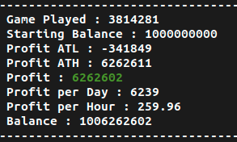
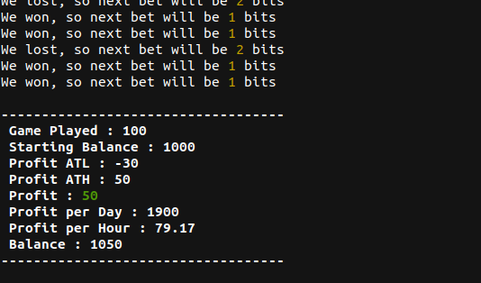
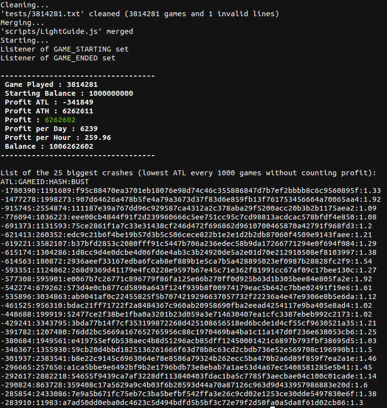

# Bustabit Script Simulator



## Table of Contents

* [About the Project](#about-the-project)
  * [Built With](#built-with)
* [Getting Started](#getting-started)
  * [Prerequisites](#prerequisites)
  * [Installation](#installation)
* [Usage](#usage)
  * [Options](#options)
  * [Examples](#examples)
* [Interacting with the game](#interacting-with-the-game)
  * [Engine API](#engine-api)
  * [Game object](#game-object)
* [Roadmap](#roadmap)
* [Contributing](#contributing)
* [License](#license)
* [Contact](#contact)
* [Acknowledgements](#acknowledgements)

## About The Project

A simple simulator made in Python and Node allows you to simulate your script on millions of Bustabit games in a very short time.
**Only 3 seconds for 1 million games**

### Built With

* [Python 3](https://www.python.org/downloads/)
* [Node.js](https://nodejs.org/en/download/)

## Getting Started

To get a local copy up and running follow these simple steps.

### Prerequisites

* Python 3
```sh
sudo apt install python3
```
* Node.js
```sh
sudo apt install nodejs
```

### Installation

1. Clone the repo
```sh
git clone https://github.com/AxelConceicao/bustabit-script-simulator.git
```
2. Download the .txt contains all Bustabit v2 games until october 2020 (3,8 milions games)
https://drive.google.com/file/d/1cvPwaAzyztIX9v1cFwFft3OSflO52TkN/view
> Why Google Drive ? Because the .txt size is 283MB and no file can be larger than 100 MB on GitHub

**Script running time for 3,8 milions games is only 15 seconds for average computer**

## Usage

### Options
```
$ python3 simulator.py -h
usage: simulator.py [-h] [-l] [-c] [-b BALANCE] script testfile

positional arguments:
  script                script to test
  testfile              file with games

optional arguments:
  -h, --help            show this help message and exit
  -l, --logs            view script logs
  -c, --crashes         display 25 biggest crashes
  -b BALANCE, --balance starting balance (default 1 bilion)
```

### Examples

```sh
python3 simulator.py scripts/Martingale.js tests/100.txt -l -b 1000
```

```sh
python3 simulator.py scripts/Martingale.js tests/50000.txt -l -b 10000
```

```sh
python3 simulator.py scripts/Martingale.js tests/100000.txt -l -b 1000000 -c
```

```sh
python3 simulator.py scripts/LightGuide.js tests/3814281.txt -c
```
> This testfile can be downloaded on Google Drive see [Installation](#installation)



The famous LightGuide script is not profitable over time unless you have at least 2 BTC as starting balance
> Why 2 BTC ? The biggest crash is -1,780 BTC without counting profit, meaning if you start your script just before the crash your ATL will be -1,780 BTC


## Interacting with the game

Almost the same as the official Bustabit engine **(unhandled features are strikethrough)**

### Engine API

The script has access to an `engine` variable which is
an Event Emitter. You attach listeners to the engine to
respond to events.

```javascript
engine.on('GAME_STARTING', function () {
  log('a game is starting')
})
```

Events:

- `"GAME_STARTING"`: Emitted when the server starts accepting bets 5 seconds before the game actually starts.
- `"GAME_STARTED"`: Bets are no longer accepted.
- `"GAME_ENDED"`
- ~~`"BET_PLACED" bet`: Whenever a player places a bet, your listener will receive the `bet` object. This event is *not* emitted for simulated bets.~~
- ~~`"PLAYERS_CHANGED"`: Is emitted whenever a player makes a bet or cashes out. This means that~~
  ~~`engine.players` and `engine.cashOuts` have been updated, respectively.~~
- ~~`"CASHED_OUT" object`: Whenever a player cashed out, this event broadcasts an object~~
~~that looks like `{ uname: string, wager: int, cashedAt: float (multiplier) }`.~~
- ...

Methods:

- `engine.bet(satoshis: Integer, payout: Float)`:
  So, `engine.bet(100, 2)` means that you are betting 100 satoshis (1 bit) with
  an autocashout at 2x. If you don't want an autocashout, just set it really high:
  `engine.bet(100, Number.MAX_VALUE)`.
- `engine.getState()`: Serializes the state of the engine into a javascript object. Can be useful for debugging.
- `engine.getCurrentBet()`: Returns falsey if you have no bet placed, else it returns `{ wager: number, payout: number }`.
- `engine.isBetQueued()`: Returns boolean, true if you have a bet enqueued for next game.
- `engine.cancelQueuedBet()`: Cancels the bet that you have enqueued for next game.
- ~~`engine.cashOut()`: Attempts to cash out the current game.~~

Properties:

- `engine.history`: A circular buffer of games (not a Javascript array).
    - `engine.history.first()`: the latest game. If `game.crashedAt` is not set, then it's the current game-in-progress.
    - `engine.history.last()`: the oldest game in the buffer which only stores **the latest 50 games**.
    - `engine.history.toArray()`: returns an `Array<Game>` so that you can use regular array methods to process the history.
- ~~`engine.playing`: A `Map()` of usernames to their bet amount. Only includes players that have not yet cashed out.~~
- ~~`engine.cashOuts`: An array of `{ wager: satoshis, uname: String, cashedAt: Float }` of all cashed out players.~~

### Game object

`engine.history` contains game objects with these keys:

- `game.id` (integer)
- `game.hash` (string)
- `game.bust` (nullable float, ex: `1.32`):
  The multiplier that the game crashed at.
  If it is not set, then the game is currently in progress.
- `game.cashedAt` (nullable float, ex: `103.45`):
  The multiplier that **WE** cashed-out at.
  If it is not set, then we either did not play that game
  or the game busted before you cashed out.
  You can check the existence of this value to determine
  if we won that game or not.
- `game.wager` (satoshis, integer, ex: `100`)

Example:

```javascript
{
  id: 114124,
  hash: '92a2adb04da8231447104f9668ac1f646e1046bbdb77333f75e8bc23e871052d',
  bust: 3.21, // or null
  cashedAt: null, // or 102.34
  wager: 1000, // that's 10 bits
}
```

## Roadmap

See the [open issues](https://github.com/AxelConceicao/Bustabit-Script-Simulator/issues) for a list of proposed features (and known issues).

## Contributing

Contributions are what make the open source community such an amazing place to be learn, inspire, and create. Any contributions you make are **greatly appreciated**.

1. Fork the Project
2. Create your Feature Branch (`git checkout -b feature/AmazingFeature`)
3. Commit your Changes (`git commit -m 'Add some AmazingFeature'`)
4. Push to the Branch (`git push origin feature/AmazingFeature`)
5. Open a Pull Request

## License

Distributed under the MIT License. See `LICENSE` for more information.

## Contact

Project Link: [https://github.com/AxelConceicao/bustabit-script-simulator](https://github.com/AxelConceicao/bustabit-script-simulator)

## Acknowledgements

* [Official Bustabit API](https://github.com/bustabit/autobet)
